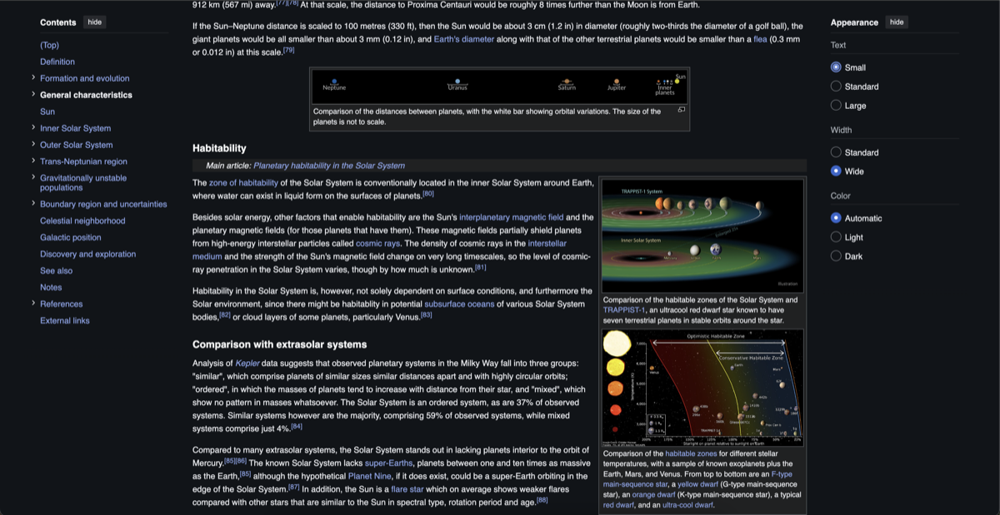
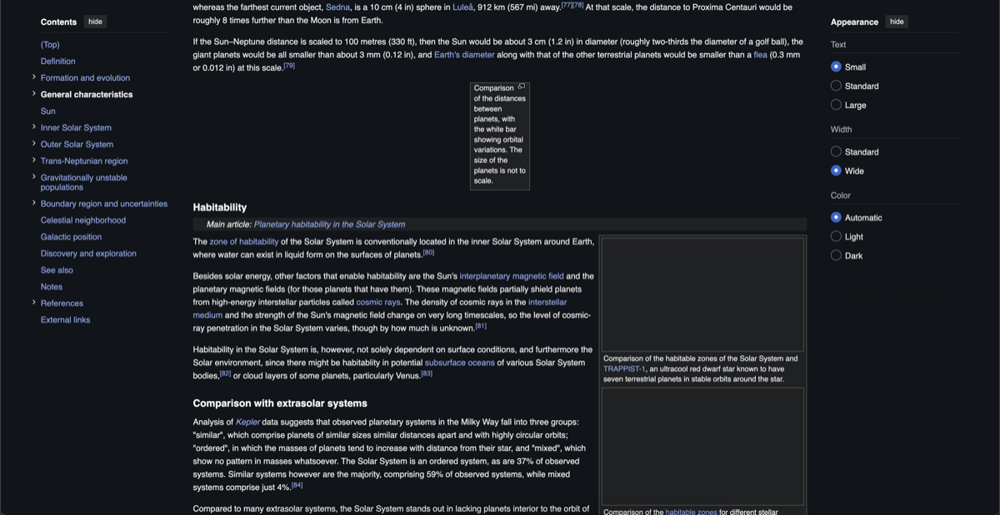

# Gray

A lightweight Chrome extension that blocks images and mutes video by default, everywhere, for faster, lighter, distraction-free pages.

No account, no server, no tracking. Everything lives in `chrome.storage.local` on your machine.

|                         Before                          |                         After                          |
| :-------------------------------------------------------: | :-------------------------------------------------------: |
|  |  |

## Why

Images and autoplaying video are most of the weight, and most of the distraction, on a typical page. Gray blocks them at the network level before they ever download, so the bytes never hit your connection, and mutes video as soon as it starts playing. Pages load faster, use less bandwidth, and stay quiet. Want images on a site you trust? Exempt it in one click.

## Features

- **Blocks images before they load** via a `declarativeNetRequest` rule, not a CSS filter, so the bytes never come down and pages render faster with less data used.
- **Mutes video** automatically, including inside same-origin iframes.
- **Per-site and per-path exceptions**: allow images on a whole domain (`example.com`) or just one section of it (`example.com/maps`).
- **Custom box color**: five presets, applied instantly across blocked images, backgrounds, and video.
- **Handles the edge cases**: CSS `background-image` (inline and stylesheet-declared), `data:`/`blob:` images that bypass network blocking, small icons/favicons (skipped so they don't render as broken boxes), and dynamically-inserted content via a `MutationObserver`.
- **A running counter** of images blocked so far, shown in the popup and dashboard.
- Global on/off switch, independent of the exemption list.
- **Simple by design**: vanilla JS, no build step, no dependencies shipped in the extension itself.

## Install

Not yet published to the Chrome Web Store. To load it locally:

1. Clone this repo.
2. Open `chrome://extensions`.
3. Enable **Developer mode** (top right).
4. Click **Load unpacked** and select the `extension/` folder.

## Usage

- Click the toolbar icon to see the current site, toggle blocking on/off globally, allow images on the current site, pick a box color, and see your running block count.
- Click **Manage exempt sites** (or right-click the icon → Options) to open the dashboard, where you can add/remove domain or domain+path exemptions directly.

## How it works

- `extension/rules.json` + `sw.js`: a static `declarativeNetRequest` ruleset blocks image requests outright, with dynamic per-domain "allow" rules layered on top for exempted sites. Path-scoped exemptions (`example.com/maps`) can't be expressed by `declarativeNetRequest` alone, so those are enforced with a per-tab session rule that the content script requests on each full page load.
- `extension/match.js`: the shared exemption-matching logic (`parseRule`/`ruleMatches`), used by both the content script and the popup so they never disagree about whether a page is exempt.
- `extension/gray.js` + `gray.css`: the content script and stylesheet that paint blocked images/backgrounds as solid boxes, flatten `data:`/`blob:` images and video with a `contrast(0)` filter (since DNR can't block those), and layer a colored overlay on top to show the chosen box color instead of plain gray.
- `extension/popup.html/js`, `options.html/js`: the toolbar popup and full dashboard, both reading/writing the same `chrome.storage.local` state.

## Development

```bash
npm install
npm test        # serves test-pages/ and runs the Cypress suite against it
```

`test-pages/` holds standalone HTML fixtures (network images, data URIs, blobs, background images, video, etc.) that the Cypress specs in `cypress/e2e/` drive against a real loaded copy of the extension.

## Permissions

| Permission | Why |
|---|---|
| `storage` | Persist settings (enabled state, exempt sites, box color, block counter) locally. |
| `activeTab` | Read the current tab's URL in the popup to show/toggle its exemption status. |
| `declarativeNetRequest` | Block image requests before they load. |
| Content script on `<all_urls>` | Paint blocked-image boxes and mute video on every page. |

No data leaves the browser. See [PRIVACY.md](PRIVACY.md) for the full policy.

## License

[MIT](LICENSE)
